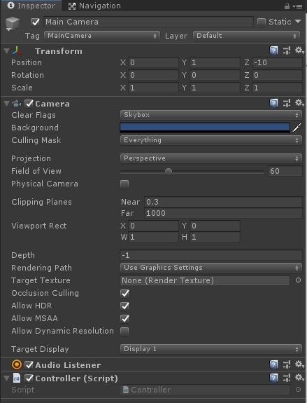
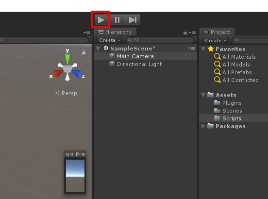
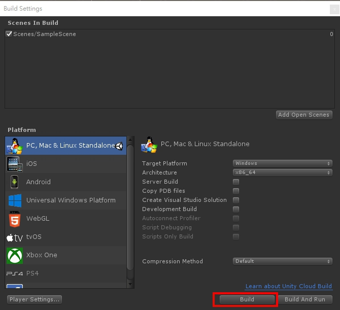

# Advertisement / QueryAllPOI

----------

## Overview

Advertisement and POI (Point of Interest) provide user to request the information of all POIs.


## Class of entire functions

```csharp
using System.Collections;
using System.Collections.Generic;
using UnityEngine;
using UnityEngine.Networking;

namespace Osense
{
    public class QueryAllPOI
    {
        private string poiData;
        private bool getDataState = false;
        private workSuccessfully = false;
        
        public QueryAllPOI(MonoBehaviour mono, string uuid)
        {
            mono.StartCoroutine(QueryPOI(uuid));
        }
        //Get the data of POI from server.
        public string GetPOIData()
        {
            return poiData;
        }
        //Confirm whether the work of coroutine is finished.
        public bool GetDataState()
        {
            return getDataState;
        }
        //Confirm whether the request of network is successful.
        public bool GetWorkState()
        {
            return workSuccessfully;
        }
        //Start a coroutine to query entire POIs and get the response from server.
        IEnumerator QueryPOI(string uuid)
        {
            WWWForm wwwF = new WWWForm();
            wwwF.AddField("uuid", uuid);
            using (UnityWebRequest www = UnityWebRequest.Post("https://osense.azurewebsites.net/vbip/app/QueryAllPOI.php", wwwF))
            {
                yield return www.SendWebRequest();
                if (www.isNetworkError || www.isHttpError)
                {
                    Debug.Log(www.error);
                    poiData = www.error;
                    workSuccessfully = false;
                }
                else
                {
                    Debug.Log(www.downloadHandler.text);
                    poiData = www.downloadHandler.text;
                    workSuccessfully = true;
                }
                getDataState = true;
                www.Dispose();
            }
        }
    }
}
```
- **QueryAllPOI**

  * `mono` - Pass the MonoBehaviour for starting a coroutine.
  * `uuid` - Pass user's encrypted ID.
## Examples
The sample code of requesting all POIs:
```csharp
using System.Collections;
using System.Collections.Generic;
using UnityEngine;
using Osense;

public class Controller : MonoBehaviour
{
    private QueryAllPOI queryAllPOI;
    
    void Start()
    {
        queryAllPOI = new QueryAllPOI(this, "BBY-em_o8vw63szvjXtkfQ");
        //Confirm whether the work of coroutine is finished. If false, wait for 0.5 second and call the function of GetData.
        if (!queryAllPOI.GetDataState())
            Invoke("GetData", 0.5f);
    }
    
    void GetData()
    {
        //Confirm whether the work of coroutine is finished. If false, wait for 0.5 second and call itself.
        if(queryAllPOI.GetDataState())
        {
            //If coroutine work successfully, get the data of POI from server.
            if(queryAllPOI.GetWorkState())
            {
                Debug.Log(queryAllPOI.GetPOIData());
                //do something...
            }
            else
            {
                //Get the information of network error
                Debug.Log(queryAllPOI.GetPOIData());
                //do something...
            }
        }
        else
            Invoke("GetData", 0.5f);
    }
}
```
## Usage
In "Hierarchy" window, select the GameObject "Main Camera", as shown below.

 

In "Project" window, drag script "Controller" into "Inspector" window, as shown below.

 

As you can see, script "Controller" is the component of GameObject "Main Camera".

 

Now you can click the "Play" button to run the scene, as shown below.

 

Or, select the target platform you want to build, as shown below.

 
