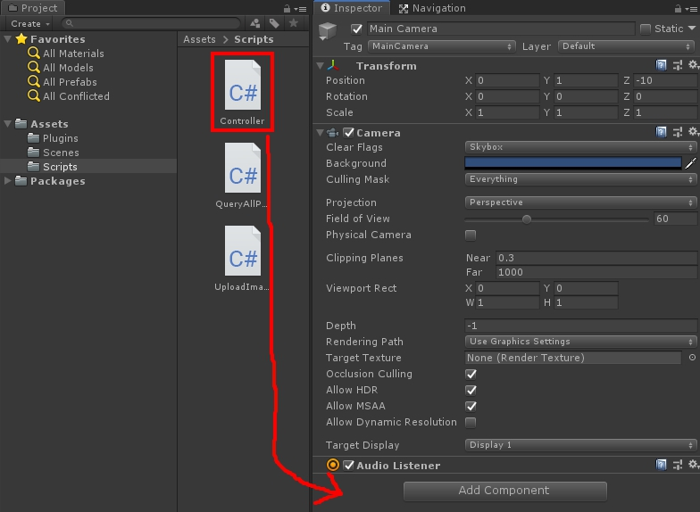

# Location / QueryLocation

----------

## Overview

QueryLocation provide user to upload a image from the current camera view of his/her mobile device , then get the infotmation of the current location from server.


## Class of entire functions

```csharp
using System.Collections;
using System.Collections.Generic;
using UnityEngine;
using UnityEngine.Networking;

namespace Osense
{
    public class UploadImage
    {
        private bool canUpload = false;
        private string respondData;
        private bool getDataState = false;
        private workSuccessfully = false;
        
        public UploadImage(MonoBehaviour mono, Texture2D texture)
        {
            this.mono = mono;
            if (!canUpload)
            {
                this.mono.StartCoroutine(Upload(texture));
            }
        }
        //Get the response from server.
        public string GetRespondData()
        {
            return respondData;
        }
        //Confirm whether the work of coroutine is finished.
        public bool GetDataState()
        {
            return getDataState;
        }
        //Confirm whether the request of network is successful.
        public bool GetWorkState()
        {
            return workSuccessfully;
        }
        //Start a coroutine to upload a image and get the response from server.
        IEnumerator Upload(Texture2D texture)
        {
            canUpload = true;
            WWWForm wwwF = new WWWForm();
            wwwF.AddBinaryData("file", texture.EncodeToJPG(), "fy6uONFUhbXiH9RiUdx3krBfrLaStukDsvIbxUrTijk.jpg");
            using (UnityWebRequest www = UnityWebRequest.Post("http://18.162.147.91/userCompute.php", wwwF))
            {
                yield return www.SendWebRequest();
                if (www.isNetworkError || www.isHttpError)
                {
                    Debug.Log(www.error);
                    workSuccessfully = false;
                    respondData = www.error;
                }
                else
                {
                    Debug.Log(www.downloadHandler.text);
                    Debug.Log("Form upload completed!");
                    workSuccessfully = true;
                    respondData = www.downloadHandler.text;
                }
                getDataState = true;
                canUpload = false;
                Debug.Log("Upload Finish !!");
                www.Dispose();
            }
        }
    }
}
```
- **UploadImage**

  * `mono` - Pass the MonoBehaviour for starting a coroutine.
  * `texture` - Pass the camera view of the mobile device.

## Examples
The sample code of requesting all POIs:
```csharp
using System.Collections;
using System.Collections.Generic;
using UnityEngine;
using Osense;

public class Controller : MonoBehaviour
{
    private UploadImage uploadImage;
    private WebCamTexture webCamTexture;
    
    void Start()
    {
        #if UNITY_ANDROID
            //Get camera permissions.
            yield return Application.RequestUserAuthorization(UserAuthorization.WebCam);
            if (!Application.HasUserAuthorization(UserAuthorization.WebCam)) yield break;
        #endif
        WebCamDevice[] devices = WebCamTexture.devices;
        for (int i = 0; i < devices.Length; i++)
        {
            //Open the rear camera
            if (!devices[i].isFrontFacing)
            {    
                webCamTexture = new WebCamTexture(devices[i].name, 1920, 1080);
            }
        }
        webCamTexture.Play();
        //Take a photo from the current camera view.
        Texture2D texture = new Texture2D(webCamTexture.width, webCamTexture.height, TextureFormat.RGB24, false);
        texture.SetPixels(webCamTexture.GetPixels());
        texture.Apply();
        CallUploadImage(texture);
    }
    
    void CallUploadImage(Texture2D texture)
    {
        uploadImage = new UploadImage(this, texture);
        if (!uploadImage.GetDataState())
            Invoke("GetRespondData", 0.5f);
    }
    
    public void GetRespondData()
    {
        //Confirm whether the work of coroutine is finished. If false, wait for 0.5 second and call itself.
        if(uploadImage.GetDataState())
        {
            //If coroutine work successfully, get the response from server.
            if(uploadImage.GetWorkState())
            {
                Debug.Log(uploadImage.GetRespondData());
                //do something...
            }
            else
            {
                //Get the information of network error
                Debug.Log(uploadImage.GetRespondData());
                //do something...
            }
        }
        else
            Invoke("GetRespondData", 0.5f);
    }
}
```
## Usage
In "Hierarchy" window, select the GameObject "Main Camera", as shown below.

 

In "Project" window, drag script "Controller" into "Inspector" window, as shown below.

 

As you can see, script "Controller" is the component of GameObject "Main Camera".

 

Now you can click the "Play" button to run the scene, as shown below.

 

Or, select the target platform you want to build, as shown below.

 